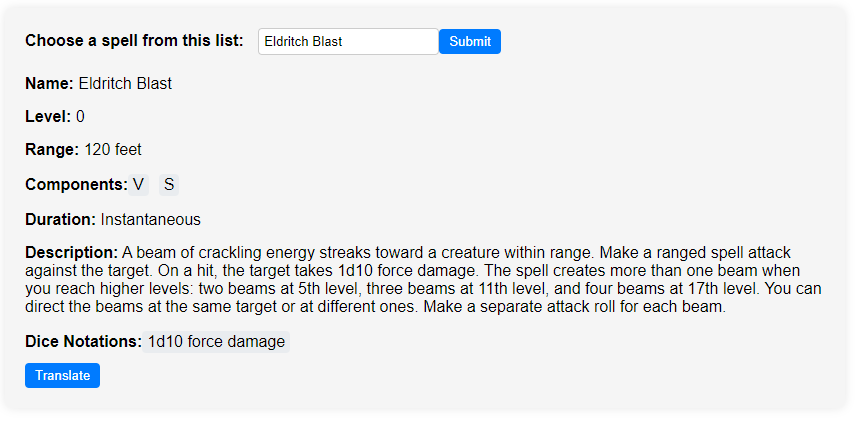

# Wizard's Grimoire
## An Intuitive Tool for Exploring D&D Spells
### Welcome to Wizard's Grimoire, a user-friendly app designed to enhance your Dungeons & Dragons experience by making it easy to find and understand spells.

## Key Features:
- **Comprehensive Wizard's Grimoire:** Browse through an extensive list of D&D spells or quickly find a specific spell by typing its name.
- **Detailed Spell Descriptions:** Access complete descriptions of spells, including their effects, components, range, and duration.
- **Enhanced Visibility:** Our app **tries** to use a regex to highlight dice notations and saving throws within spell descriptions, making them easier to read and understand. (Probably better to use when you already know the spell and want to check it's damage or saving throw)
- **Language Translation:** (Unofficial) Translate spell descriptions between English and Portuguese (EN-PT).


 

## How to Run Locally:
1. Clone the repository.
2. Install dependencies by running: 
    ```bash
    npm install
    ```
3. Start the development server with:
    ```bash
    npm run dev
    ```

## How to Access Remotely:
- Visit the app at: [https://gustavo-qs.github.io/spell_search/](https://gustavo-qs.github.io/spell_search/)
- It's a Progressive Web App (PWA)! You can download it to your phone and use it offline for a seamless D&D experience.

### Wizard's Grimoire is here to simplify your offline, in-person D&D adventures. Enjoy offline spellcasting!